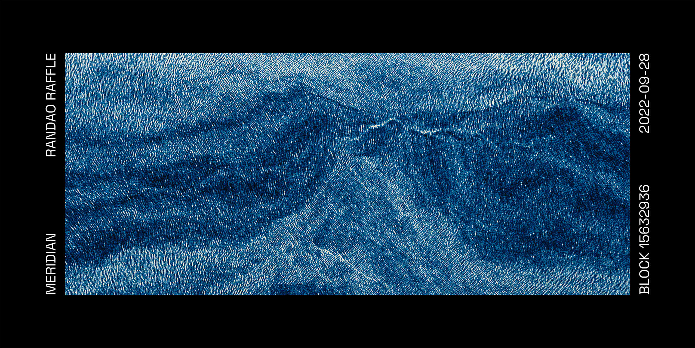

# Meridian "Community Curated" Raffle



From Sept 15 to 23, users had a chance to vote on their favourite [Meridians](https://meridian.mattdesl.com/) within the Art Blocks `#matt-deslauriers` Discord channel to influence the "Community Curated" chapter of the upcoming [Meridian book](https://vetroeditions.com/products/meridian).

As a bonus, and to celebrate the 1-year anniversary of Meridian's release on September 28th, users who voted have been placed into two separate raffles:

- Book Raffle: A chance to win a signed copy of the book (if you voted for one or more Meridians)
- NFT Raffle: A chance to win [Meridian #784](https://opensea.io/assets/ethereum/0xa7d8d9ef8d8ce8992df33d8b8cf4aebabd5bd270/163000784) (if you voted for all 14 different Meridian Styles)

The raffle winners will be announced September 28th on Twitter and the Art Blocks Discord. The winners will be decided with the _Trusted Setup Ceremony_ described below.
ers.

## Trusted Setup Ceremony

To create a fair raffle, I've decided to use a bit of cryptography and single leader election driven by Ethereum's new Proof of Stake RANDAO mechanism[^1]. In Ethereum, each new block proposed to the network includes a `PREVRANDAO` field, which is a pseudo-random 256-bit integer.[^2] This integer will be used as a seed to select the raffle winners randomly from the list of eligible us

> ###### 🎨✨ Consider this ceremony partly an artistic performance using the blockchain, and partly a multi-party computation scheme for a cryptographically verifiable random raffle.

### Technical Details

The ceremony will use two random integers:

- `BLOCK_KEY` — this is a 256-bit integer from `block.mixHash` (PREVRANDAO value) of Ethereum mainnet block `15632936`
- `ARTIST_KEY` — this is a 256-bit random integer that I generated prior to the raffle, and which I will only reveal after the ceremony

After Ethereum finalizes block `15632936` (around Wed, 28 Sep 2022 16:01:35 GMT), I will run the [raffle script](./src/raffle-select.js) to find the winning usernames for each raffle. This does the following:

1. Query the PREVRANDAO value from block `15632936` to find `BLOCK_KEY`
2. Compute `state = xor(BLOCK_KEY, ARTIST_KEY)` to get a 256-bit random state
3. Feed the first 128 bits of `state` into the seedable PRNG `sfc32`[^3]
4. Use the seeded PRNG to compute two random numbers that will select the winning user IDs in [raffle_book.csv](./output/raffle_book.csv) and [raffle_nft.csv](./output/raffle_nft.csv), respectively.

#### The Block Key

One contribution of randomness is from Ethereum's RANDAO mechanism, which is very hard to game. Somebody attempting to influence RANDAO would need to be a validator (which itself is costly) and the chance of them being selected as a block producer at a given slot is very low, unless they control a massive percentage of all staked Ether. Block producers cannot choose a specific RANDAO integer, but they can choose to opt-out of producing a block, and so they have a very limited 1 bit of biasability.

#### The Artist Key

Theoretically, it _is_ possible (albeit extremely unlikely) that a colluding group of Ethereum block producers could slightly bias the RANDAO value to their benefit in this raffle. To mitigate against this theoretical biasing, I am also keeping secret an `ARTIST_KEY`, which is a random 256-bit integer that will be XORed with the RANDAO value to produce a final state for randomness. I will only publicly reveal this `ARTIST_KEY` value after the raffle.

This means that even though a validator could potentially bias RANDAO, they would not be able to predict in which way their bias would affect the raffle output.

Because of this, the ceremony is not _completely_ trust-minimized, as you also have to trust that I am not staking so much ETH that I can influence the raffle (the cost of reliably biasing RANDAO is in the order of hundreds of millions of USD).[^4]

#### SHA-256 Commitments

To ensure that I don't change `ARTIST_KEY` and other parameters (list of users, raffle script) after the target block is finalized, I published SHA-256 commitments to this data on [Twitter](https://twitter.com/mattdesl/status/1574866811987927040) and [Farcaster](farcaster://casts/0x0715896c86914e3d203028fb003f60ef8faa53640d4a1e768d0029474eeccd01/0x0715896c86914e3d203028fb003f60ef8faa53640d4a1e768d0029474eeccd01) on September 27, 2022. After I reveal the results, you can hash the data with SHA-256 to see I have not modified the inputs into the raffle program.

Details:

```sh
# blockNumber
A = 15632936

# SHA256(secretKey)
B = 189bc0e76a8ef2ab969fc9a347908727dcabab7daf932c5501eeb74403e1beb3

# SHA256(raffle_book.csv)
C = d577870690325eebc1da51d0f65bea56525fdcf55354eadafff17257839d18f4

# SHA256(raffle_nft.csv)
D = fbb28a230d18c91461863fa2818876537474f2a75bd75345d1aedf368eaa1c4f

# SHA256(raffle-select.js)
E = 5e11097b39ffe5de9386b43bc2576fb69ea0bdb6dc900a85d5156b5773efd9e8
```

#### Caveats

If there are any bugs or critical issues raised with the ceremony, I may adjust the ceremony and re-run it (or even use another method of raffle selection).

If the selected user for whatever reason cannot accept the prize (or cannot be reached in a reasonable time frame), the subsequent random value of the `sfc32()` function will be used to determine the next winner, and so on.

The architecture of this means that there is a very small chance that the same user will win both raffles.

#### Data Collection

The data and list of eligible users in the [./output](./output) folder was collected with the scripts in [./src](./src). The snapshot was taken on the following date:

```sh
Timestamp: 1664293722841
Date: Tue, 27 Sep 2022 15:48:42 GMT
```

#### Special Thanks

Thanks to the following people who took the time to review this scheme and provide feedback:

- Piter Pasma (@piterpasma)
- Alexis André (@MacTuitui)
- Tim Beiko (@TimBeiko)

Note that this scheme may not be perfect and bug-free. Feel free to send feedback.

## Source Code

This repository includes a set of utilities and functions around the ceremony that may prove useful to other developers:

- [predict-block-number](./src/predict-block-number.js) — predict a block number from a future date based on Ethereum Proof of Stake's 12-second slot time
- [random-256bit](./src/random-256bit.js) — a Node function to generate a "0x" prefixed 256-bit integer hex string with a cryptographically secure PRNG
- [scrape-discord](./src/scrape-discord.js) — tools for scraping discord messages en masse
- [raffle-select](./src/raffle-select.js) — the actual raffle program

You will need to add a `.env` file in the repository with your own private (secret) configuration:

```
INFURA_API_KEY="YOUR_API_KEY_VALUE"
DISCORD_TOKEN="YOUR_TOKEN_KEY_VALUE"
RANDOM_VALUE="THE_ARTIST_KEY_VALUE"
```

## Voting Results

Some additional data points computed from the 6,962 scraped Discord messages in the [output](./output/) folder.

- **Total Messages since opening:** 6,962
- **Total Votes Counted:** 3,369
- **Number of Users Voted:** 279
- **Number of Users in Book Raffle:** 277
- **Number of Users in NFT Raffle:** 201
- **Meridian IDs receiving 1 or more votes:** 525
- **Total Emoji Reactions Counted:** 839
- **Top Emoji Reaction:** ❤️ (x365)
- **Emojis Reactions:** ❤️, 🔥, 🤌, 💙, 😍, 🤍, 💯, 👀, 🙌, 👍, 🤝, 🍻, ✅, 🆓, ❤️‍🔥, 🎉, 👍🏻, 🌈, 🐻, 🍕, ✌️, 💪🏻, 🐸, ➕, 😊, 🤯, 😌, 🤣, 🌄, 🙃, 🤌🏼, 🙏, ❓, 🍦, 🍊

## License

MIT, see [LICENSE.md](http://github.com/mattdesl/meridian-discord-voting/blob/master/LICENSE.md) for details.

[^1]: You can read more about the mechanics of RANDAO [here](https://eth2book.info/altair/part2/building_blocks/randomness#updating-the-randao).
[^2]: This integer is computed by aggregating the BLS signature of each block producer.
[^3]: Reference: https://github.com/bryc/code/blob/master/jshash/PRNGs.md#sfc32
[^4]: Statistical analysis on Ethereum k-consecutive block proposal probabilities: https://alrevuelta.github.io/posts/ethereum-mev-multiblock
